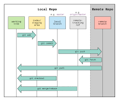

# My Project
## Tell me how to remove them locally and remotely.
##Delete locally
> `git branch -d dev      # Delete dev branch`
> `git branch -d test     # Delete test branch`

##Delete remotely
> git push origin --delete dev
> git push origin --delete test

## Tell me how to checkout another branch without commit changes
> git stash
> git checkout
> git stash pop

## Tell me how to list tags 
> git tag

## Tell me how to delete tag locally and remotely.
> ` git tag -d v1.7      # Delete locally`
>  `git push origin --delete v1.7  # Delete remotely`

----------------------------------------------

